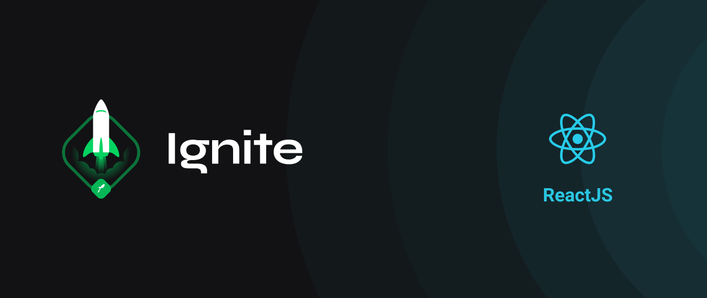
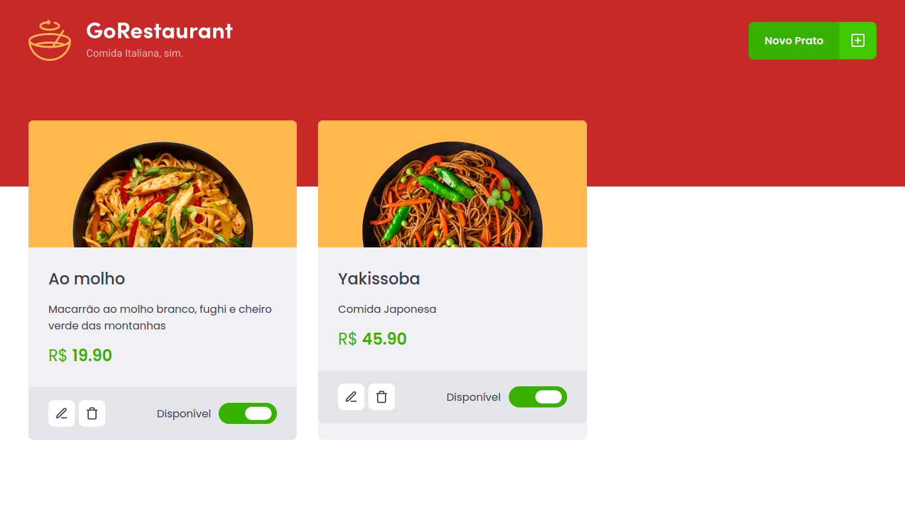

<h1 align="center">🚀 Rocketseat - 🔥Ignite - Trilha ReactJs</h1>

<h2 align="center">Desafio 02 - Refactoring de classes e typescript ( Projeto GoRestaurant )</h2>

## 📖 Sobre o Projeto
O projeto consiste em uma aplicação de listagem de pratos, que são consumidos de uma fake api, o desafio pede para efetuar a troca da aplicação de componentes de classes para componentes funcionais e também migrar a aplicação para typescript de forma que tudo funcione perfeitamente como na forma anterior.

## 🌠 Imagem do projeto 


## 🧰 Tecnologias Utilizadas
* ReactJS
* Axios
* TypeScript
* Styled-Componets

## ⚙ Como rodar o projeto
#### Crie uma pasta 
```bash
mkdir react-ignite-refactoring-classes-ts
```
#### Clone este repositório para a pasta anterior ou use a opção de download:
```bash
git clone https://github.com/alissonrsantos/ignite-reactjs-refactoring-classes-ts.git
```
#### Instale as dependências
```bash
yarn 
```
ou
```bash
npm install
```
#### Sobe o JSON Server que rode a api Fake para consumo dos dados dos arquivos json:
##### Abra um terminal que esteja na pasta do projeto e de o seguinte comando
```bash
yarn server
```
#### Executando o Projeto
```bash
yarn start
``` 
ou
```bash
npm start
```

#### Acesse http://localhost:3000 no seu navegador

## 🌎 Especificações do Projeto
[Desafio 02 - GoRestaurant](https://www.notion.so/Desafio-02-Refactoring-de-classes-e-typescript-4571541e7f8c4799bd191b6cfb53802c) - Notion com todas as informações.

## Licença
&copy; MIT

Feito com ❤ por Alisson Romão Santos | [LINKEDIN](https://www.linkedin.com/in/alissonrsantos).